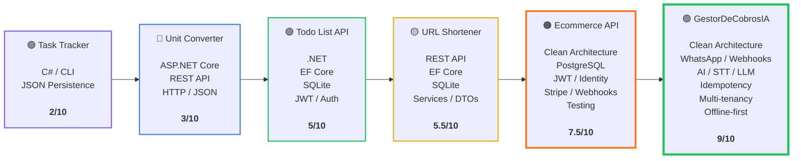

## 🚀 Backend Engineering Progression

From simple C# projects to complex backend systems, each project introduced new engineering challenges, technologies and architectural concepts.

<h3 align="center">📈 Mi Evolución y Proyectos (.NET & C#)</h3>

<table align="center">
<tr>
<td align="center" width="150" valign="top">
<a href="https://github.com/tu-usuario/task-tracker">
  
<b>Task Tracker</b>  
C# / CLI JSON Persistence
</a>
</td>
<td align="center" width="150" valign="top">
<a href="https://github.com/tu-usuario/unit-converter">
  
<b>Unit Converter</b>  
ASP.NET Core REST API HTTP / JSON
</a>
</td>
<td align="center" width="150" valign="top">
<a href="https://github.com/tu-usuario/todo-list-api">
  
<b>Todo List API</b>  
.NET EF Core SQLite JWT / Auth
</a>
</td>
<td align="center" width="150" valign="top">
<a href="https://github.com/tu-usuario/url-shortener">
  
<b>URL Shortener</b>  
REST API EF Core SQLite Services / DTOs
</a>
</td>
<td align="center" width="150" valign="top">
<a href="https://github.com/tu-usuario/ecommerce-api">
  
<b>Ecommerce API</b>  
Clean Architecture PostgreSQL JWT / Identity Stripe / Webhooks Testing
</a>
</td>
<td align="center" width="150" valign="top">
<a href="https://github.com/tu-usuario/gestor-cobros-ia">
  
<b>GestorDeCobrosIA</b>  
Clean Architecture WhatsApp / Webhooks AI / STT / LLM Idempotency Multi-tenancy Offline-first
</a>
</td>
</tr>
</table>

