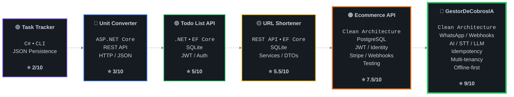

## 🚀 Backend Engineering Progression

From simple C# projects to complex backend systems, each project introduced new engineering challenges, technologies and architectural concepts.

```mermaid
flowchart LR
    A["🟣 <b>Task Tracker</b><br/><br/><code>C#</code> • <code>CLI</code><br/>JSON Persistence<br/><br/><b>⭐ 2/10</b>"]
    --> B["🔵 <b>Unit Converter</b><br/><br/><code>ASP.NET Core</code><br/>REST API<br/>HTTP / JSON<br/><br/><b>⭐ 3/10</b>"]
    --> C["🟢 <b>Todo List API</b><br/><br/><code>.NET</code> • <code>EF Core</code><br/>SQLite<br/>JWT / Auth<br/><br/><b>⭐ 5/10</b>"]
    --> D["🟡 <b>URL Shortener</b><br/><br/><code>REST API</code> • <code>EF Core</code><br/>SQLite<br/>Services / DTOs<br/><br/><b>⭐ 5.5/10</b>"]
    --> E["🟠 <b>Ecommerce API</b><br/><br/><code>Clean Architecture</code><br/>PostgreSQL<br/>JWT / Identity<br/>Stripe / Webhooks<br/>Testing<br/><br/><b>⭐ 7.5/10</b>"]
    --> F["🚀 <b>GestorDeCobrosIA</b><br/><br/><code>Clean Architecture</code><br/>WhatsApp / Webhooks<br/>AI / STT / LLM<br/>Idempotency<br/>Multi-tenancy<br/>Offline-first<br/><br/><b>⭐ 9/10</b>"]

    %% Enlaces a tus repositorios (reemplaza los links)
    click A "[https://github.com/tu-usuario/task-tracker](https://github.com/tu-usuario/task-tracker)" "Ir a Task Tracker"
    click B "[https://github.com/tu-usuario/unit-converter](https://github.com/tu-usuario/unit-converter)" "Ir a Unit Converter"
    click C "[https://github.com/tu-usuario/todo-list-api](https://github.com/tu-usuario/todo-list-api)" "Ir a Todo List API"
    click D "[https://github.com/tu-usuario/url-shortener](https://github.com/tu-usuario/url-shortener)" "Ir a URL Shortener"
    click E "[https://github.com/tu-usuario/ecommerce-api](https://github.com/tu-usuario/ecommerce-api)" "Ir a Ecommerce API"
    click F "[https://github.com/tu-usuario/gestor-cobros-ia](https://github.com/tu-usuario/gestor-cobros-ia)" "Ir a GestorDeCobrosIA"

    %% Estilos de bordes, fondos y colores de flechas
    style A fill:#161b22,color:#c9d1d9,stroke:#8b5cf6,stroke-width:2px
    style B fill:#161b22,color:#c9d1d9,stroke:#3b82f6,stroke-width:2px
    style C fill:#161b22,color:#c9d1d9,stroke:#22c55e,stroke-width:2px
    style D fill:#161b22,color:#c9d1d9,stroke:#eab308,stroke-width:2px
    style E fill:#161b22,color:#c9d1d9,stroke:#f97316,stroke-width:3px
    style F fill:#161b22,color:#c9d1d9,stroke:#22c55e,stroke-width:4px
    
    linkStyle default stroke:#8b949e,stroke-width:1px,stroke-dasharray: 3 3
```

