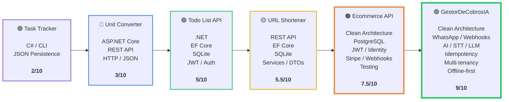

## 🚀 Backend Engineering Progression

From simple C# projects to complex backend systems, each project introduced new engineering challenges, technologies and architectural concepts.

<h3 align="center">📈 Mi Evolución y Proyectos (.NET & C#)</h3>

<table align="center" style="border-collapse: collapse;">
  <tr>
    <!-- Task Tracker -->
    <td align="center" width="160" valign="top" style="border: 2px solid #8b5cf6; border-radius: 8px; padding: 10px; background: #0d1117;">
      <a href="https://github.com/tu-usuario/task-tracker" style="text-decoration: none; color: inherit;">
        <b>🟣 Task Tracker</b>
        

        
C# / CLI JSON Persistence

        

        <b>2 / 10</b>
      </a>
    </td>

    <!-- Unit Converter -->
    <td align="center" width="160" valign="top" style="border: 2px solid #3b82f6; border-radius: 8px; padding: 10px; background: #0d1117;">
      <a href="https://github.com/tu-usuario/unit-converter" style="text-decoration: none; color: inherit;">
        <b>🔵 Unit Converter</b>
        

        
ASP.NET Core REST API HTTP / JSON

        

        <b>3 / 10</b>
      </a>
    </td>

    <!-- Todo List API -->
    <td align="center" width="160" valign="top" style="border: 2px solid #10b981; border-radius: 8px; padding: 10px; background: #0d1117;">
      <a href="https://github.com/tu-usuario/todo-list-api" style="text-decoration: none; color: inherit;">
        <b>🟢 Todo List API</b>
        

        
.NET EF Core SQLite JWT / Auth

        

        <b>5 / 10</b>
      </a>
    </td>

    <!-- URL Shortener -->
    <td align="center" width="160" valign="top" style="border: 2px solid #f59e0b; border-radius: 8px; padding: 10px; background: #0d1117;">
      <a href="https://github.com/tu-usuario/url-shortener" style="text-decoration: none; color: inherit;">
        <b>🟡 URL Shortener</b>
        

        
REST API EF Core SQLite Services / DTOs

        

        <b>5.5 / 10</b>
      </a>
    </td>

    <!-- Ecommerce API -->
    <td align="center" width="160" valign="top" style="border: 2px solid #f97316; border-radius: 8px; padding: 10px; background: #0d1117;">
      <a href="https://github.com/tu-usuario/ecommerce-api" style="text-decoration: none; color: inherit;">
        <b>🟠 Ecommerce API</b>
        

        
Clean Architecture PostgreSQL JWT / Identity Stripe / Webhooks Testing

        

        <b>7.5 / 10</b>
      </a>
    </td>

    <!-- GestorDeCobrosIA -->
    <td align="center" width="160" valign="top" style="border: 2px solid #22c55e; border-radius: 8px; padding: 10px; background: #0d1117;">
      <a href="https://github.com/tu-usuario/gestor-cobros-ia" style="text-decoration: none; color: inherit;">
        <b>🟢 GestorDeCobrosIA</b>
        

        
Clean Architecture WhatsApp / Webhooks AI / STT / LLM Idempotency Multi-tenancy Offline-first

        

        <b>9 / 10</b>
      </a>
    </td>
  </tr>
</table>

