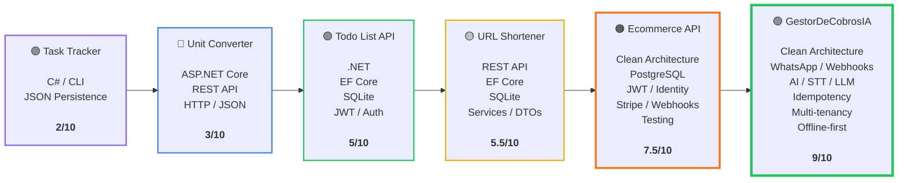
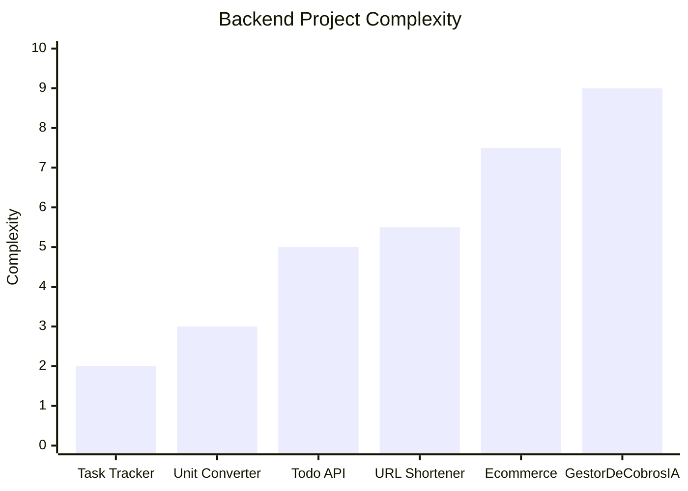
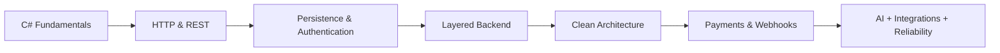

## 🚀 Backend Engineering Progression

From simple C# projects to complex backend systems, each project introduced new engineering challenges, technologies and architectural concepts.

### 📈 What the progression represents

### 🧠 What changed from project to project

